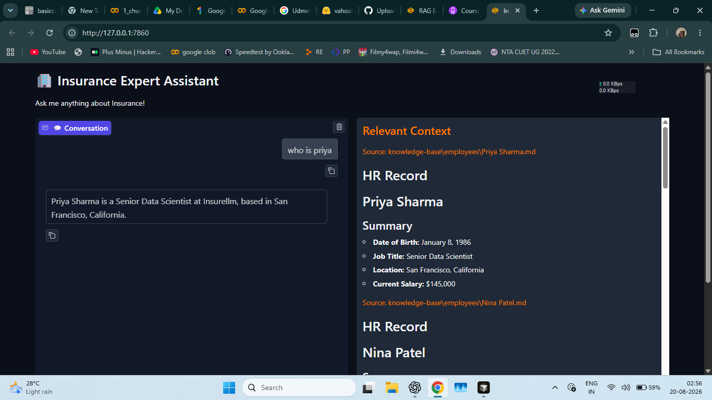
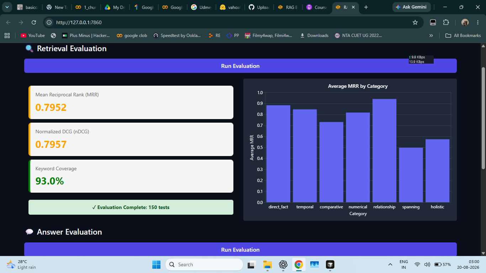
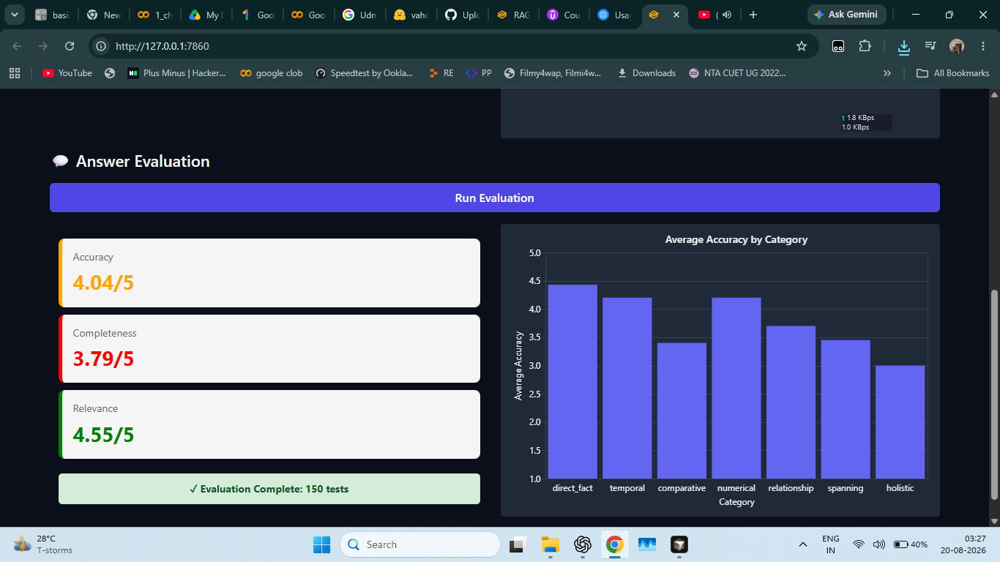

insurance-knowledge-assistant/
│
├── app.py
├── evaluator.py
├── insurance.ipynb
├── requirements.txt
├── README.md
│
├── evaluation/
│   ├── eval.py
│   ├── test.py
│   └── tests.jsonl
│
└── assets/
    ├── chatbot.png
    ├── retrieval-evaluation.png
    └── answer-evaluation.png
    # Insurance Knowledge Assistant

An AI-powered insurance knowledge assistant built using **Retrieval-Augmented Generation (RAG)**. The system retrieves relevant information from an insurance knowledge base using vector search and uses an LLM to generate context-grounded answers.

## Features

* RAG-based question answering
* OpenAI embeddings for semantic search
* ChromaDB vector database
* Document chunking with Recursive Character Text Splitter
* Context-aware answer generation
* Gradio-based chatbot interface
* Relevant context visualization
* Retrieval evaluation using MRR, nDCG, and keyword coverage
* LLM-as-a-judge answer evaluation
* Evaluation across 150 test questions
* Category-wise evaluation analysis

## System Architecture

```text
Knowledge Base
      │
      ▼
Document Loading
      │
      ▼
Text Chunking
      │
      ▼
OpenAI Embeddings
      │
      ▼
ChromaDB Vector Store
      │
      ▼
User Question
      │
      ▼
Semantic Retrieval
      │
      ▼
Relevant Context
      │
      ▼
GPT-4.1-nano
      │
      ▼
Generated Answer
```

## Technologies Used

| Technology       | Purpose               |
| ---------------- | --------------------- |
| Python           | Core development      |
| LangChain        | RAG pipeline          |
| OpenAI           | Embeddings and LLM    |
| ChromaDB         | Vector database       |
| Gradio           | User interface        |
| Pydantic         | Structured evaluation |
| Pandas           | Evaluation analysis   |
| LiteLLM          | LLM evaluation        |
| Jupyter Notebook | Experimentation       |

## Knowledge Base

The assistant uses a structured insurance knowledge base containing information about:

* Company
* Employees
* Products
* Contracts

Documents are loaded from Markdown files and divided into smaller chunks before being converted into vector embeddings.

## Chatbot

The application provides a conversational interface where users can ask questions about Insurellm.



The interface also displays the retrieved context used to generate the answer, making the RAG pipeline more transparent.

## Retrieval Evaluation

The retrieval system was evaluated using **150 test questions** across multiple categories:

* Direct Fact
* Temporal
* Spanning
* Comparative
* Numerical
* Relationship
* Holistic

### Retrieval Results

| Metric           |      Score |
| ---------------- | ---------: |
| MRR              | **0.7952** |
| nDCG             | **0.7957** |
| Keyword Coverage |  **93.0%** |
| Test Questions   |    **150** |



### Retrieval Interpretation

The system achieves **93% keyword coverage**, indicating that most expected information is retrieved from the knowledge base.

The overall MRR of **0.7952** and nDCG of **0.7957** indicate that relevant information is generally ranked near the top of the retrieved results.

## Answer Evaluation

Generated answers were evaluated using an LLM-as-a-judge approach on three dimensions:

* Accuracy
* Completeness
* Relevance

### Answer Results

| Metric         |        Score |
| -------------- | -----------: |
| Accuracy       | **4.04 / 5** |
| Completeness   | **3.79 / 5** |
| Relevance      | **4.55 / 5** |
| Test Questions |      **150** |



### Answer Interpretation

The system achieves its strongest score in **relevance (4.55/5)**, showing that generated responses generally stay focused on the user's question.

Accuracy reaches **4.04/5**, while completeness is **3.79/5**, indicating that some answers could provide more of the information contained in the retrieved context.

## Evaluation Categories

The evaluation dataset contains 150 questions distributed across:

```text
Direct Fact       70
Temporal          20
Spanning          20
Comparative       10
Numerical         10
Relationship      10
Holistic          10
```

This provides a broader evaluation than testing only simple factual questions.

## Project Structure

```text
insurance-knowledge-assistant/
│
├── app.py
├── evaluator.py
├── insurance.ipynb
├── requirements.txt
├── README.md
│
├── evaluation/
│   ├── eval.py
│   ├── test.py
│   └── tests.jsonl
│
├── implementation/
│   ├── answer.py
│   └── ingest.py
│
├── knowledge-base/
│   ├── company/
│   ├── contracts/
│   ├── employees/
│   └── products/
│
└── assets/
    ├── chatbot.png
    ├── retrieval-evaluation.png
    └── answer-evaluation.png
```

## Installation

Clone the repository:

```bash
git clone https://github.com/chetan0722/insurance-knowledge-assistant.git
cd insurance-knowledge-assistant
```

Create a virtual environment:

```bash
python -m venv .venv
```

Activate it on Windows:

```bash
.venv\Scripts\activate
```

Install dependencies:

```bash
pip install -r requirements.txt
```

## Environment Variables

Create a `.env` file:

```text
OPENAI_API_KEY=your_openai_api_key
```

Do not commit your `.env` file or API key to GitHub.

## Running the Application

Run the Gradio application:

```bash
python app.py
```

The application will start on a local Gradio URL.

## Running Evaluation

Run retrieval evaluation:

```bash
python -m evaluation.eval 0
```

The evaluation dashboard can also be launched through the evaluator application:

```bash
python evaluator.py
```

## Evaluation Methodology

### Retrieval Evaluation

The retrieval pipeline is evaluated using:

**MRR (Mean Reciprocal Rank)**

Measures how highly the first relevant result is ranked.

**nDCG (Normalized Discounted Cumulative Gain)**

Measures the quality of the ranking of relevant retrieved documents.

**Keyword Coverage**

Measures the percentage of expected keywords found in the retrieved context.

### Answer Evaluation

Answer quality is evaluated using an LLM judge that compares the generated answer with a reference answer.

The evaluation considers:

* Accuracy
* Completeness
* Relevance

Scores range from **1 to 5**.

## Results Summary

```text
                    SCORE
──────────────────────────────
MRR                 0.7952
nDCG                0.7957
Keyword Coverage   93.0%

Accuracy            4.04 / 5
Completeness        3.79 / 5
Relevance           4.55 / 5

Evaluation Tests    150
```

## Future Improvements

* Add reranking for retrieved documents
* Improve performance on spanning and holistic questions
* Experiment with hybrid search
* Add similarity-score thresholds
* Improve chunking strategies
* Add conversational memory
* Evaluate additional embedding models
* Add automated evaluation reports
* Deploy the application online

## Author

**Chetan**

M.Tech Data Science
Harcourt Butler Technical University, Kanpur

## License

This project is intended for educational and portfolio purposes.
